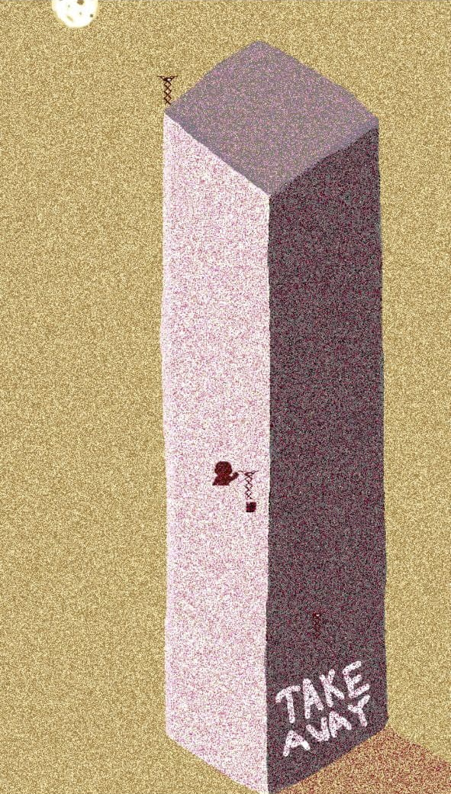

# [Raising Hunter (Moorhuhn in cave art)](https://ismo.itch.io/raisinghunter)

A game where you are a sniper with a postapocalyptic narrative and an experimental cave art style with modern elements like skyscraper and unmanned aircraft systems (UAS).

Lore

While our society grows bigger and the buildings grow taller there is one still keeping our traditions. Surviving with old crafts. This game is showing you the world. You can see how the one protects the machines which dispatch supplies. And it is 2020, we cannot go out, so we have to rely on the machines as our only way to transport resources.... and since these machines are the only ones with access to food: the enemy is not just dangerous for our system, but also life.

How to Play

Touch or click the level to aim and lift up to shoot. If you want to have rewards shot on the enemy's UAS. Your job is to identify them, to protect the parcel delivery system. To win you have to see which UAS look, sound or behave suspiciously.

Currently the implementation does not include any enemies but can you can try out the shooting mechanics and clear the game world from the friendly UAS or just watch how a take away delivery company like Lieferando, Deliveroo or Foodpanda will look like? 

# I planned the progress with Test-Driven Development and you can see how the manual tests become simpler from the top to the bottom 

Moorhuhn in cave art with skyscraper and UAS + item system in own scene + day to day + procedural storytelling

Moorhuhn in cave art with skyscraper and UAS + item system in own scene + day to day

Moorhuhn in cave art with skyscraper and UAS + item system in own scene

Moorhuhn in cave art with skyscraper and UAS